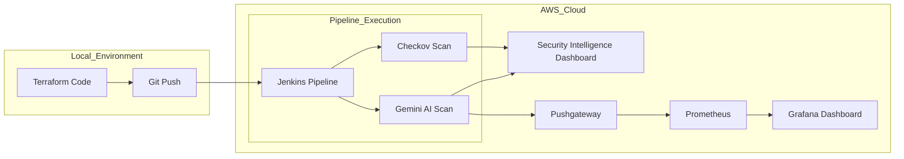

# 🛡️ Gemini-Shield: AI-Powered DevSecOps Intelligence


**Gemini-Shield** is a next-generation DevSecOps pipeline that integrates **Google Gemini 2.0 Flash** intelligence into the CI/CD lifecycle. It goes beyond traditional static analysis by using LLMs to provide context-aware vulnerability detection and automated remediation suggestions for Infrastructure as Code (IaC).

---

## 🏗️ System Architecture



---

## ✨ Key Features

*   **🤖 AI-Driven Security Audits**: Leverages Gemini 2.0 Flash to analyze complex Cloud configurations that static tools often miss.
*   **📊 Intelligence Dashboard**: A custom "Gemini-Shield" Command Center with side-by-side comparison of risks and AI-suggested fixes.
*   **📈 Real-time Monitoring**: Integrated Prometheus & Grafana stack for tracking security trends and pipeline health.
*   **⚡ Async Evaluation**: Optimized asynchronous scanning to handle multiple IaC files without blocking the pipeline.
*   **🛡️ Multi-Tool Validation**: Combines the precision of Checkov with the intelligence of LLMs for defense-in-depth.

---

## 🚀 Getting Started

### 1. Prerequisites
*   AWS Account & EC2 Instance (Amazon Linux 2)
*   Docker & Docker Compose
*   Google Gemini API Key ([Get it here](https://aistudio.google.com/))

### 2. Installation
```bash
# Clone the repository
git clone https://github.com/SaiAnnirudh/llm-devsecops-pipeline.git
cd llm-devsecops-pipeline

# Start the Monitoring Stack
cd monitoring
docker-compose -f docker-compose-monitoring.yml up -d
```

### 3. Pipeline Configuration
1.  Add your `GEMINI_API_KEY` to **Jenkins Credentials**.
2.  Configure a Pipeline Job pointing to this repository.
3.  The pipeline will automatically trigger on every git push!

---

## 🖥️ Security Intelligence Dashboard

The project includes a professional dashboard to visualize scan results.

1.  Navigate to the `app/` directory.
2.  Run a local server: `python -m http.server 8081`.
3.  Open `http://localhost:8081` and upload your `llm_validation_results.json`.

---

## 📊 Monitoring & Metrics

Access your monitoring stack at these endpoints:

*   **Jenkins UI**: `http://<EC2-IP>:8080`
*   **Grafana**: `http://<EC2-IP>:3000` (User: `admin`, Pass: `admin`)
*   **Prometheus**: `http://<EC2-IP>:9090`
*   **Pushgateway**: `http://<EC2-IP>:9091`

---

## 🛠️ Tech Stack

*   **Cloud**: AWS (VPC, EC2, S3, IAM)
*   **CI/CD**: Jenkins, Docker
*   **AI**: Google Gemini 1.5 Flash / 2.0 Flash
*   **IaC**: Terraform
*   **Monitoring**: Prometheus, Grafana, Pushgateway
*   **Frontend**: Vanilla JS, Inter/Roboto Typography, CSS Glassmorphism

---

## 📝 License
This project is licensed under the MIT License - see the [LICENSE](LICENSE) file for details.
